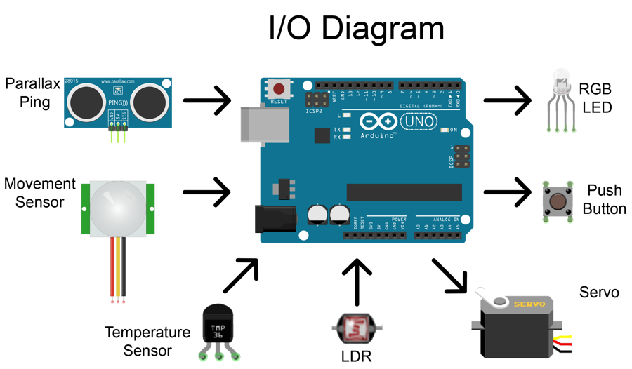
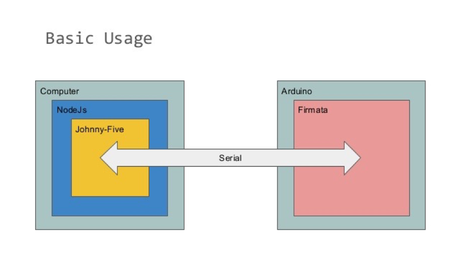
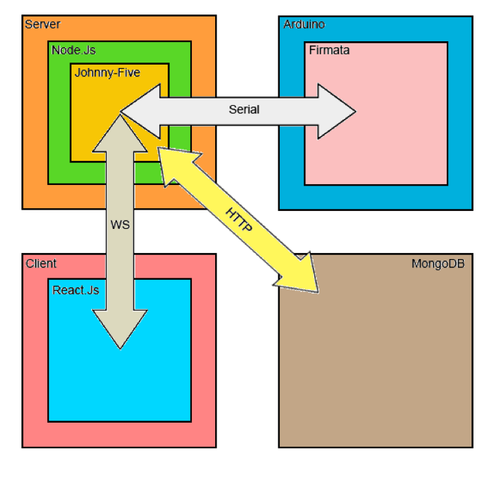
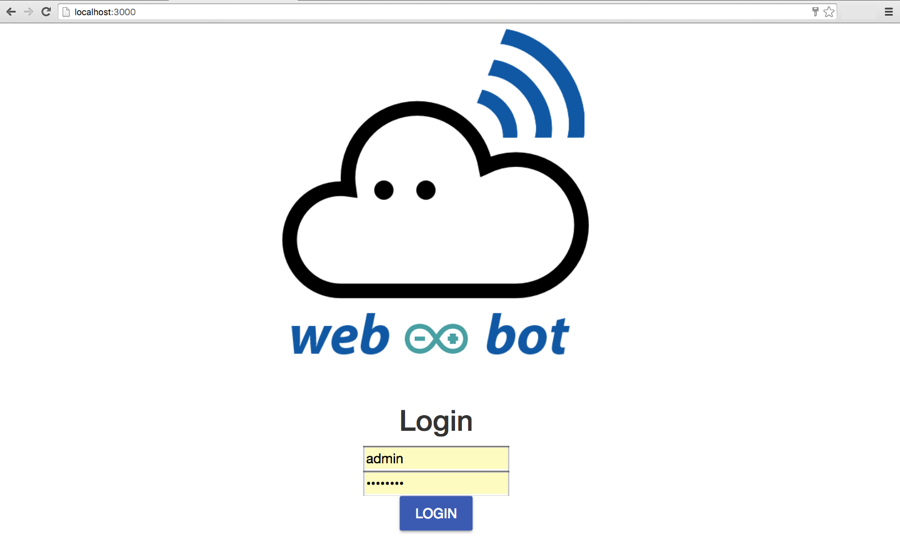
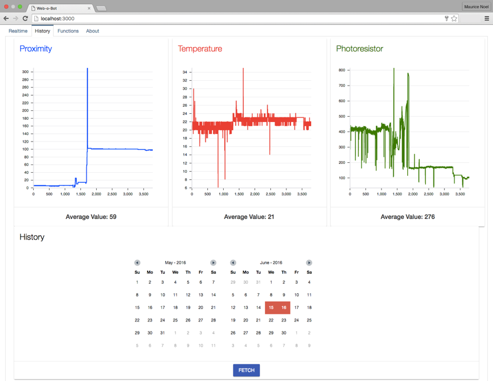
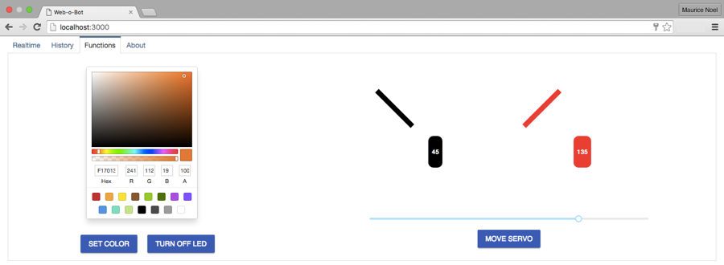

# webOBot
### Home Automation with Arduino & JS

This is my thesis project for completing the Electronic Engineering studies in the Technological Educational Institute of Central Greece.

The fundamental idea behind this project was to built a system for home automation, monitoring and interaction with ones home environment remotely. Utilising the Arduino platform and the MERN stack.
For the implementation, a three-tier architecture and different technologies were used. The technologies are: Arduino, JavaScript (Johnny-Five, React), Node, MongoDB and WebSocket. 

### Abstract
It is a fact that in recent years, automation and more specific applications in industry, at home, in the workplace, multiply and grow. Through the internet many automations provide the possibility for remote control, which is combined with the economic materials and thus constantly creating new web automation applications.
The purpose of the project is to create an automated web system that finds application in the home and provide remote control of systems associated with it.
The system consists of an Arduino board, to which an ultrasound sensor, a motion, a temperature, a photoresist, and a button, a LED and a servo are connected.
The Arduino is connected via serial with the computer, who plays the role of parent as in parent - child architecture, Arduino gives measurements, and accepts commands only when requested by the computer - server.
The measurements are recorded in a database, providing the user the ability to look older measurements inside a period of time.
For the interaction of the user and the application, a browser is used, where orders are given and measurements are presented in graphs.
In this thesis, there is the analysis of the connections and the hardware structure, software and communication of each system to the other.

### Arduino board / Circuit 
Using the Arduino platform which is cheap and easy to prototype and test out different circuits, with a variety of sensors and components for data acquisition and control (*Diagram 1*). 
The sensors used in this project are:  
- **Parallax Ping** sensor, for proximity sensing
- **Movement sensor**, for movement sensing
- **TMP 36** Temperature sensor, for reading the current temperature
- **LDR** (Light Dependent Resistor), for sensing the current light temperature
- **Servo** motor, for moving certain parts of the system remotely
- **Button**, for feedback and to test performance
- **RGB LED**, used as a feedback, to control lighting based on a ColorPicker

Diagram 1: Board diagram

### Server - Board
The hardware and back-end of the system is built with the help of Firmata, Johnny-Five and NodeJS. The connection between the server and the circuit is done via serial bus, utilising the USB of the board (*Diagram 2*).

**Firmata**: a library that contains the firmware for many different components and sensors. Some customisation was required for several components to work.

**Johnny-Five**: a JavaScript library, mainly used for creating robots and autonomous vehicles based on the Arduino platform, allows for communication with Firmata.

**NodeJS**: the systems back-end consists of a Node running for controlling the Arduino and allows for remote control.

Diagram 2: Server - Board Diagram

### Complete Stack
For the whole system to work, three main protocols are used, ReactJS for the Client, Node for the Server and MongoDB for storing and reading (*Diagram 3*).

**WebSocket**: a communication protocol for *real-time* readings and actions, provides an almost instantaneous response, as this system takes care of security, which is crucial.

**HTTP**: used as the protocol between the Server and the Data Tier, for its robustness and simplicity.

**MongoDB**: a document-based database was used for its responsiveness, no need for schema, and speed. As several readings happen every couple of seconds an SQL database would have some performance hits.

**React**: React being the awesome framework it is, heleped with building a pleasant front-end.

Diagram 3: Stack Diagram

## App Screenshots

**Login View**

**Charts View**

**Functions - Controls View**

## Hardware

Special thanks are given to [ApoEco](https://github.com/apoeco "ApoEco GitHub"), React Guru! 
For mentoring and helping through the whole project.
